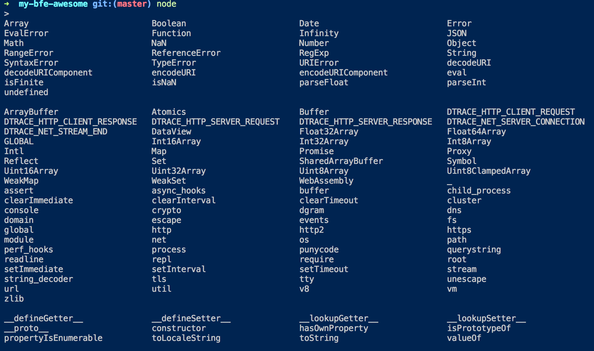

# my-bfe-awesome
前端个人积累

- [node 相关](#node-相关)
  - [node 常量](#node-常量)

- [电子书](#电子书)
- [webpack](#webpack)
- [移动端调试](https://github.com/choukin/my-bfe-awesome/issues/1)


## node 相关
### node 常量
- `__dirname` ：全局变量，存储的是代码所在文件的所在的文件目录
- `__filename`：全局变量，存储的是代码所在文件的文件名

```js
// /work/coding/githubbuild/my-bfe-awesome/test.js
console.log(__dirname)
// /work/coding/githubbuild/my-bfe-awesome
console.log(__filename)
// /work/coding/githubbuild/my-bfe-awesome/test.js
```

- 查看全局对象 再终端输入 node 后 安两次 tab键
  
  


## 电子书
- [深入浅出 Webpack ](http://webpack.wuhaolin.cn/)
- [ECMAScript 6 入门](http://es6.ruanyifeng.com/)

## [webpack]
- 生成html的插件 https://github.com/ampedandwired/html-webpack-plugin 配置
```js
new HtmlWebpackPlugin({
    filename: path.resolve(config.build.assetsRoot, 'index.html'), // 生成的html的文件名
    template: 'index.html', // 依据的模板
    inject: true, // 注入的js文件将会被放在body标签中,当值为'head'时，将被放在head标签中
    minify: { // 压缩配置
    removeComments: true, // 删除html中的注释代码
    collapseWhitespace: true, // 删除html中的空白符
    removeAttributeQuotes: true, // 删除html元素中属性的引号
    minifyJS: {
        compress: {
        warnings: false
        }
    },
    // 更多配置
    // https://github.com/kangax/html-minifier#options-quick-reference
    },
    chunksSortMode: 'dependency' // 按dependency的顺序引入
}
```