# chrome app 列表
- [ublock origin是一款专门为浏览器开发的网页广告拦截过滤插件](http://www.xue51.com/soft/2278.html)
- [一键管理所有扩展](https://chrome.google.com/webstore/detail/%E4%B8%80%E9%94%AE%E7%AE%A1%E7%90%86%E6%89%80%E6%9C%89%E6%89%A9%E5%B1%95/niemebbfnfbjfojajlmnbiikmcpjkkja)
    * 用于：快捷停用启用浏览器插件
- [JSON Formatter](https://chrome.google.com/webstore/detail/json-formatter/bcjindcccaagfpapjjmafapmmgkkhgoa)   
    * 用于：格式化网络请求来的JSON字符串
-  Anything to QRcode
    * 用于：将地址栏网址快捷生成二维码
- [Octotree](https://chrome.google.com/webstore/detail/octotree/bkhaagjahfmjljalopjnoealnfndnagc)
    * 用于：为Github 库添加快捷访问的侧边栏文件树
- Validity
    * 用于：检查网页中的错误，如：标签的闭合、属性的遗漏、优化建议
- Speed Dial 2 中文版
    * 用于：将浏览器新标签页变成快捷拨号页
- [AdBlock](https://chrome.google.com/webstore/detail/adblock/gighmmpiobklfepjocnamgkkbiglidom)
    * 用于：屏蔽广告
- Backbone Debugger
    * 用于：Backbone 开发，查看各种Backbone实例的详情
- [React Developer Tools](https://github.com/facebook/react-devtools)
    * 用于：React开发工具
-  [Vue.js devtools](https://chrome.google.com/webstore/detail/vuejs-devtools/nhdogjmejiglipccpnnnanhbledajbpd)
    * 用于：Vue开发工具
    * [github 仓库](https://github.com/vuejs/vue-devtools)
-  Proxy SwitchyOmega
    * 用于：快捷管理切换浏览器代理。搭配科学上网
   1.   Axure RP Extension for Chrome
                 用于：让谷歌支持打开Axure（产品原型）插件


# 如何用Chrome编辑以及调试代码

翻译[原文](https://blog.openreplay.com/how-to-use-chrome-as-a-code-editor-and-debugger) 

很少有开发者慎入研究浏览器的"开发者工具"，现在浏览器的开发者工具有一系列令人望而生畏的复杂功能，可以让Chrome作为完整的开发环境。我们不太可能放弃VS Code 或者Sublime Text 等编辑器。但是如果在别人的电脑上或需要编辑简单的代码时，浏览器是一个不错的选择。

下面几节介绍如何使用 Chrome 的编辑和调试工具。 Chromium, Edge, Opera, Vivaldi, 和 Brave 等浏览器使用的引擎和工具与Chrome一样。根据浏览器和系统不同，可以通过菜单或者快捷键打开开发者工具 window 下按 `F12` mac 系统 `shift + command + C` 打开并定位到 Element tab 栏 `option + command + I` 打开并定位到Console栏；Safari 和 Firfox 有不同工具集，它们也有自己的方式来帮助开发者，例如 都有Console和Element等；

## 快速编辑任何站点

在浏览本地或线上站点的页面时，可以在 `Element` 元素面版 检查，禁用， 启用，添加，编辑，或删除 CSS选择器或属性:

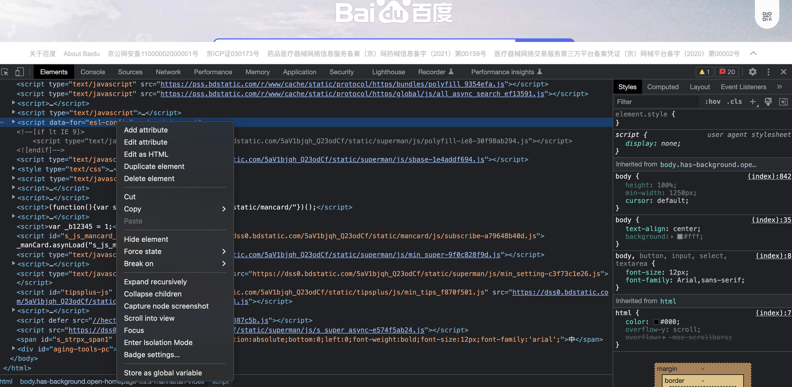

`Sources` 面版中可以通过page 栏定位和编辑 CSS 或 JavaScript。

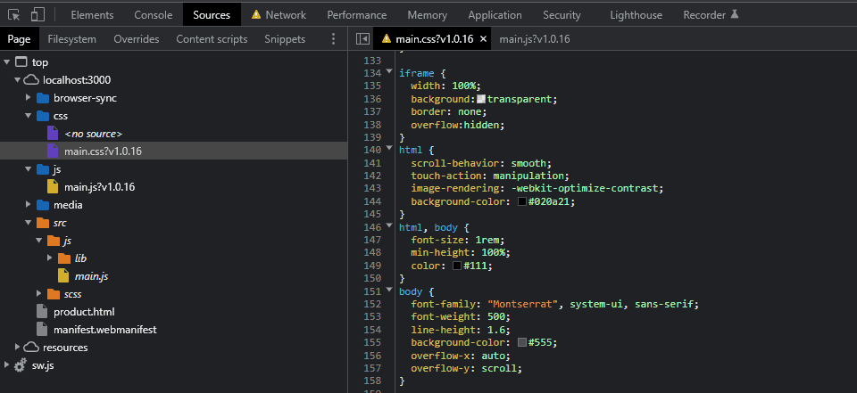

编辑后按 Ctrl / Cmd + S 来保存修改后的内容，请注意保存在了内存中，黄色的警告表示修改不是永久的。

如果你的代码定义了Source maps，你可以打开“Files”(看上面的src 文件夹)，但修改后的代码不会在当前页面起作用。但是你可以点击`{}` 来美化压缩后的代码然后进行编辑。

只有跳转或刷新页面修改就会丢失。幸运的是，`Changes` 面版可以查看我们的修改内容。 这个面版通过右侧三个点的菜单打开：

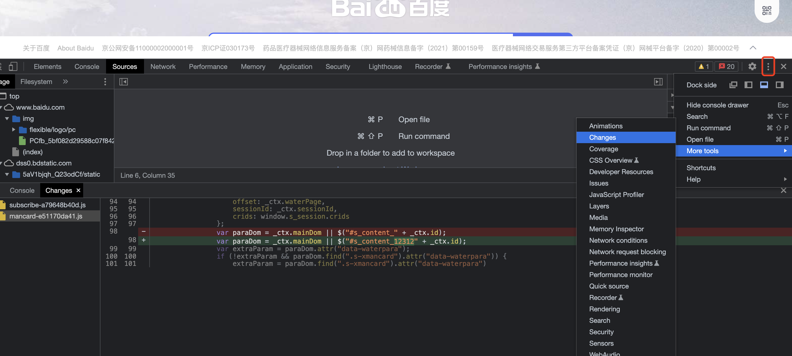

虽然无法从 `Changes` 面板中保存代码，但是可以定位到所有修改后的文件。通过右键选择保存到本地从而导入到自己的项目中。


## 覆盖站点文件

可以覆盖任何本地开发或者线上的站点文件。 `Source -> Overrides + Select folder for overrides`:

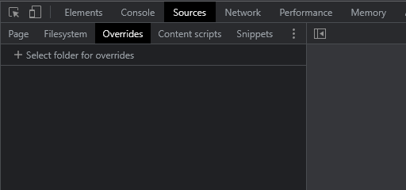

选择一个电脑中的文件夹，然后点击 `允许` 这样Chrome 就可以写入了。

返回到 `Page`面板在任何一个文件中右键 选择 `Save for Overides`:

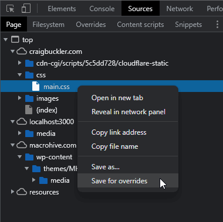

这样就会把文件保存到你刚才选择的文件夹中，文件会出现一个紫色小圆圈表示这个文件在本地：
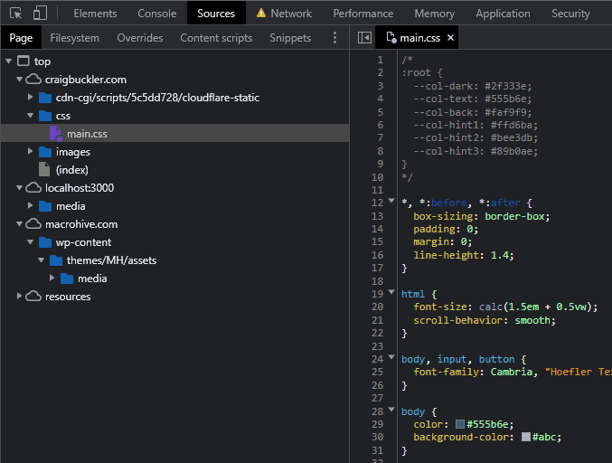

可以点击 `{}` 来美化压缩的代码，或者做其他修改。修改会立即渲染，因为文件是本地的。只要打开开发者工具，这些变更就会在这个网站上起作用。

`Changes` 面板仍然显示代码差异，你可以将编辑后的文件复制到自己的项目中，请记住，你编辑的是最终生成后的文件，可能需要对项目中的源码进行响应的编辑。


## 编辑开发中的源文件
我们可以把Chrome当作一个本地源文件开发的标准文本编辑器，无论使用的是何种构建方式。它提供了大多数基础的编辑功能，行号，撤销/重做，颜色编码，自动提示；启动方式，在`Sources` 面板中打开 `Filesystem` 面板，然后点击 `+ Add folder to workspace`:

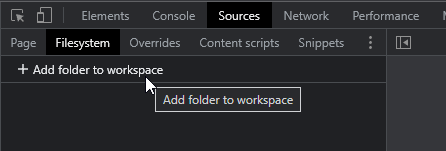

选择一个本地的项目，然后点击 `Allow` 这样Chrome 就有了对文件夹的读写权限。我们可以像在编辑器里一样打开和编辑任何文件了：
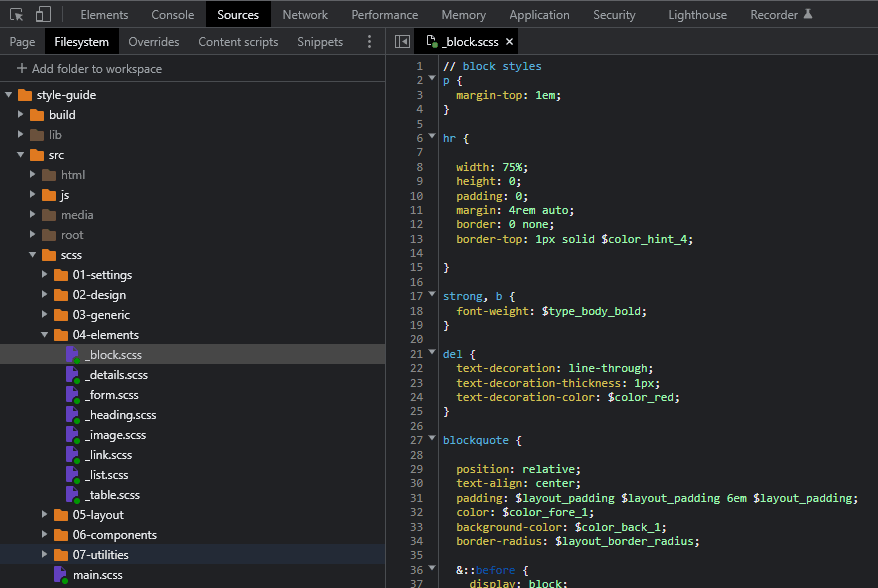

## 使用控制台信息调试

一些开发者要求永远不要使用 `console.log()`:因为这样是对源码的修改，并且有更好的调试方式。这是对的，但是我不相信有人会说他永远都没用过 它！console 对象提供了一系列方法包括：

|console 方法|描述|
|:-:|:-:|
|.log(msg)|在控制台打印信息|
|.log('%j', obj)|将对象作为压缩JSON字符串输出|
|.dir(obj, opt)|格式化输出对象和属性|
|.table(obj)|以表格的形式输出数组和对象|
|.error(msg)|输出一个错误信息|
|.count(label)|命名记录器，记录某行的执行次数|
|.countReset[label]|重置命名记录器|
|.group(label)|设置分组信息的起始位置|
|.groupEnd(label)|设置分组信息的结束位置|
|.time(label)|启动计时器以计算操作的持续时间|
|.timeLog(label)|报告计时器启动后经过的时间|
|.timeEnd(label)|结束计时器，并且报告总耗时|
|.trace()|用于显示当前执行的代码在堆栈中的调用路径|
|.clear()|清空 控制台|


console.log 还接受多个值逗号分隔的值:

```js
let x = 321;
console.log('x:', x);
// x: 321
```

ES6 解构的写法

```js
let x = 321;
console.log({x});
// x: 321
```

## 调试客户端应用

我们可以在你`Sources` 面板打开一个JavaScript 文件，点击任意一行来设置断点，请注意在Source maps 文件中选择文件添加断点更简单.

断点指定调试器暂停处理的点，方便我们检查程序的状态并进行到下一行。可以定义任意数量的断点，但一般只需要在开始调试的地方设置断点.

运行代码**可以刷新页面或激活事件处理程序**代码将在断点位置停止。

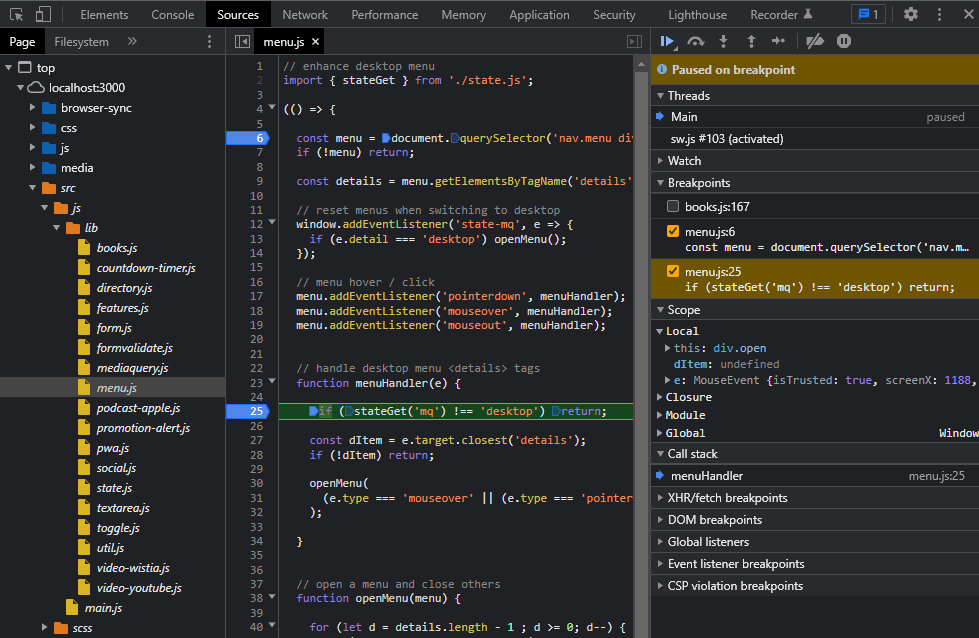

右侧面板包括：

- `Watch` 可以通过点击 `+`添加要监视变量变化的名称
- `Breakpoints` 列出了所有的断点，也可以禁用或启用断点
- `Scope` 显示所有局部和全局变量的状态
- `Call Stack` 列出了当前函数的调用栈

断点消息上方的一行图标：

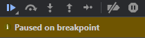

从左到右图标的作用如下：

- 1、继续执行： 继续处理程序，直到下一个断点或代码结束运行
- 2、跳过： 执行下一个命令，但是保持在当前函数内，不会跳到任何这个函数调用的函数里
- 3、单步执行：执行下一个命令并跳转到它调用的任何函数中
- 4、单步退出：继续处理程序，并定位到函数本调用的位置.
- 5、步骤： 类似单步执行，只是它不会跳转到异步函数中
- 6、跳过所有断点：如果希望临时在不中断的情况下运行代码，但有不想丢失断点时，这个功能非常有用
- 7、异常暂停: 在出现错误时程序暂停


`DevTools` 提供了更多的调试选项，除了手动添加断点外，还可以在代码中添加调试语句，当开发者工具被打开时就会激活调试语句，记得在生产环境删除调试；

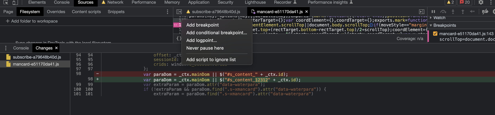

`条件断点` 在执行前检查值，假设你有一个从0 到 999的循环，需要在最后一次循环中查看状态，不用跟进断点循999次，你可以在指定行右键，选择`Add conditional breakpoint` 然后输入比如 `loopValue === 999`.

`logpoint` 时无代码的`console.log()`! 在行号上右键选择 Add logpoint 然后添加表达式：
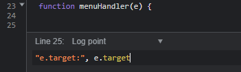


`DOM breakpoints`每当JavaScript代码修改DOM节点或子节点时就会触发，在`Elements`面板中通过右键单击任何节点，选择“DOM breakpoints” 然后选择适当的选项来启用。

`Ajax breakpoints`调试通过JavaScript 调用的`Fetch()`或`XMLHttprequest`检索数据时会激活；在`Sources`面板中打开右侧的`XHT/fetch Breakspoints` 单击  + 并输入完整或部分接口地址来启用断点。

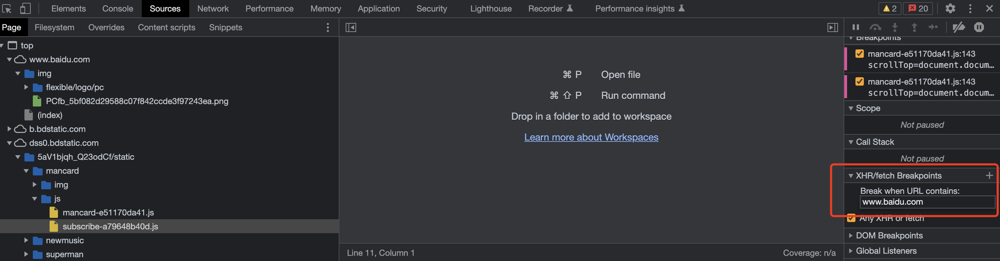

最后，有时我们想要忽略我们不能修改的代码，比如，jQuery, React 第三方JavaScript 统计代码等。点击⚙️图标打开设置面板，选择`Ignore list` 添加任意数量的完整或部分文件路径名，这样，调试器会跳过这些文件的代码或异常。

## 调试Node.js 和 Deno 应用


我们也可以在浏览器开发者工具中直接调试服务端应用，因为运行时环境都使用的是V8 引擎。通过 `--inspect`标识来加载你的应用从而开启V8引擎的检查。比如：启用一个Node应用
```sh
 node -- inspect index.js
```

deno 和 `nodemon` 支持`--inspect`参数，也可以使用`--inspect-brk` 在第一行暂停，以便在应用启动后单步执行。

这个命令启动调试器会监听址`localhost:9229` 任何本地调试客户端都可以链接到

```sh
Debugger listening on ws://127.0.0.1:9229/301372bc-780a-2051-ceb2-c8d78227092e
```

如果是在其他设备或Docker容器中运行的应用，请确保端口`9229`和指定ip`0.0.0.0` 可以在局域网内访问：
```sh
node --inspect=0.0.0.0:9229 index.js
```

应用程序运行后，打开Chrome 输入`chrome://inspect` 查看可用的应用：
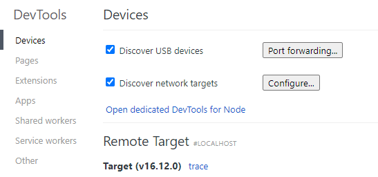

几秒后应用会出现砸 `Remote Target` 列表中，如果没出现， 确保选择了`Discover network targets`，并且点击`Configure` 来添加应用所在设备的IP和端口

点击 应用的`inspect` 链接来启动另一个开发者工具窗口，和浏览器开发者工具相比，他的选项较少，你主要可以使用`Sources`面板来添加断点，和之前一样虚啊者`FileSystem` 面板点击`+ Add folder to workspace` 来编辑服务器代码。 


## 其他受欢迎的工具

- `Network` 中在选择任意一个`Fetch/XHR`请求右键 `Copy` 选项可以生成有效的代码比如`JavaScript` `Node.js` `cURL` 等。

- 在 `Sources` 面板中打开图片，右键可以复制 base64 数据
- 在 `Sources -> Snippets` 面板中添加代码，在任何页面中执行相同的JavaScript
等等。。

