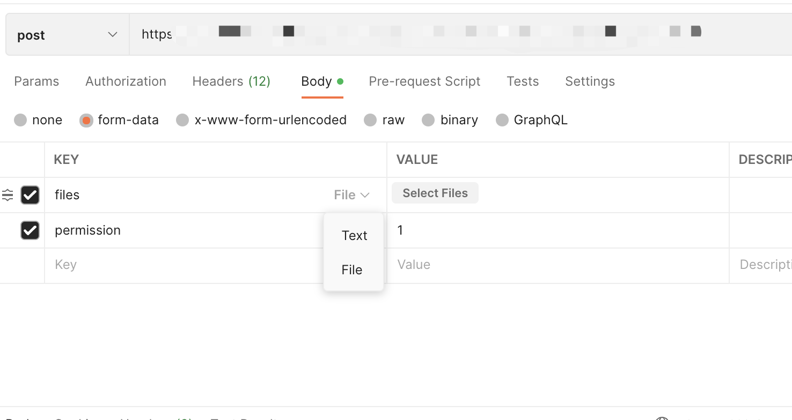
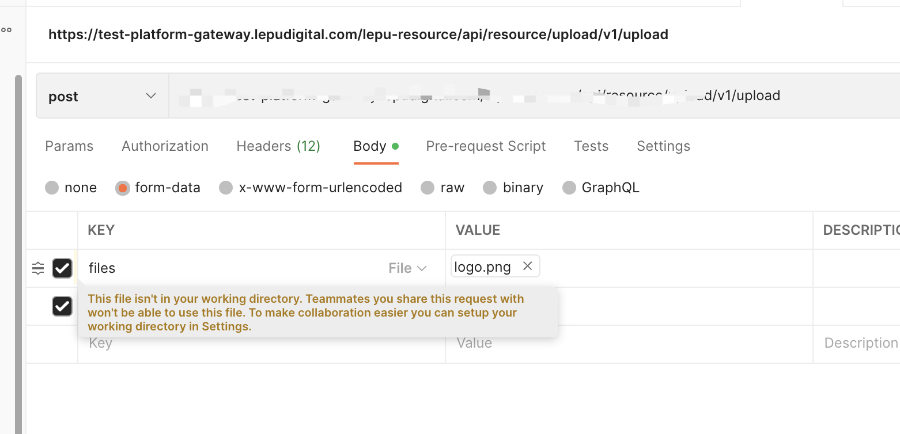
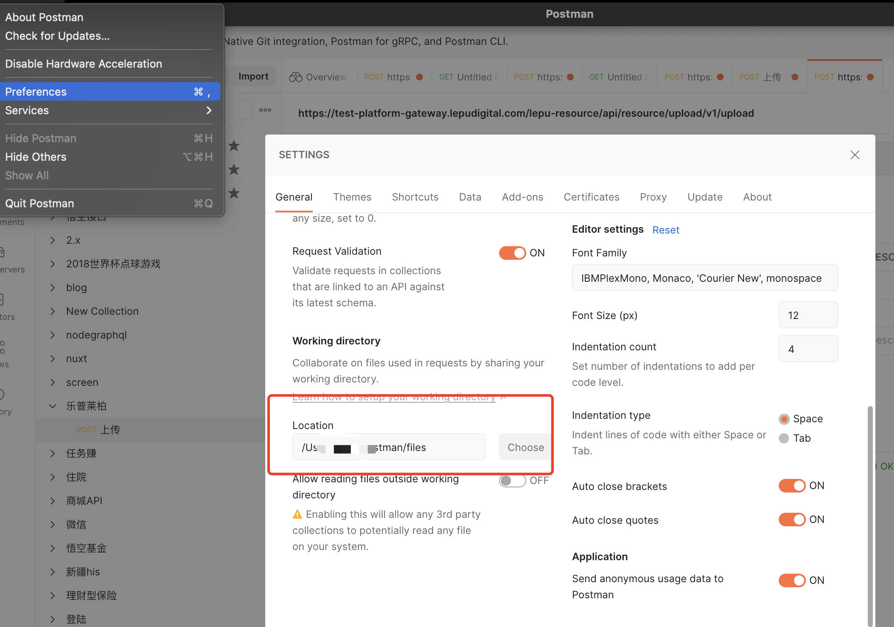
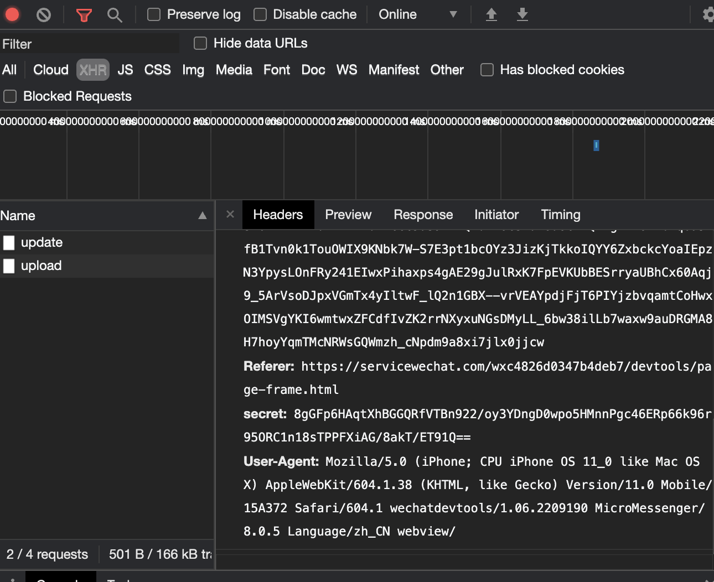

# 上传下载乱码踩到的小坑

## 上传

最近开发微信小程序，上传接口总是调不通，微信开发者工具又看不到上传的数据流数据，服务端同学收不到数据流。记录下解决问题的流程；


用 `Postman` 模拟上传定位问题

- 设置上传字段选择`file`

  

- 选择上传文件
  

`This file isn't in your working directory. Teammates you share this request with won't be able to use this file. To make collaboration easier you can setup your working directory in Settings.`

提示文件不在工作文件夹中，需要先设置`Postman` 的工作文件夹




设置完成后，请求上传发先还不行😩，经提醒发现服务端给的接口字段错误，修改字段等候上传成功！


疑惑的是微信为啥不让在开发者工具中看到数据流?




## 下载

下载 excel 格式的数据时文件名称中文乱码 `订å__æ_°æ_®20220915.xls`, 服务端同学由于是个年轻人，一直没有好办法解决，最后百度到一个好方案 `https://juejin.cn/post/7003254534969491493` 

思路是服务端通过`UTF-8`把中文编码，前端拿到名称后再解码


前端部分代码
```ts
import { saveAs } from 'file-saver';

// 导出订单
export function orderExport(params: OrderRecord) {
  return axios.post(
    '/dispatch/export/v1.0',
    {
      ...params,
    },
    {
      silence: true,
      responseType: 'blob',
    }
  );
}

  const handleExport = () => {
    orderExport({
      ...formModel.value,
    }).then((res) => {
      // 从header中拿到filename 并解码
      const fileName = decodeURI(
        res.headers['content-disposition'].split('filename=')[1]
      );
      const blob = new Blob([res.data]);
      saveAs(blob, fileName);
    });
  };
```

服务端部分代码
```java
@Override
    public ResponseEntity<byte[]> toResponse() {
        this.close();
        try {
            FileInputStream fis = new FileInputStream(this.csvFile);
            ByteArrayOutputStream bos = new ByteArrayOutputStream();
            byte[] b = new byte[1024];
            int n;
            while ((n = fis.read(b)) != -1) {
                bos.write(b, 0, n);
            }
            fis.close();
            bos.close();
            HttpHeaders httpHeaders = new HttpHeaders();
            String encodeName = URLEncoder.encode(this.name + SUFFIX, "UTF-8");
            String fileName = encodeName.replace("+", "%20");
            httpHeaders.setContentDispositionFormData("attachment", fileName);
            httpHeaders.setContentType(MediaType.APPLICATION_OCTET_STREAM);
            httpHeaders.setAccessControlExposeHeaders(Collections.singletonList("Content-Disposition"));
            return new ResponseEntity<>(bos.toByteArray(), httpHeaders, HttpStatus.CREATED);
        } catch (IOException e) {
            throw new BaseException(CSV_IO_EXCEPTION);
        }
    }

```

以上，记录这两个小问题；


