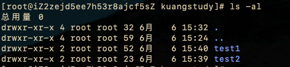

# Linux常用命令

## 目录基础操作
-  cd 切换目录
  - cd <目录名> （绝对路径/相对目录）.. 上一层  ～当前用户目录
- ls 列出目录
  - -a: all  包括隐藏目录
  - -l： 列出所有文件

- mkdir <目录名> 创建目录
    - -p: 递归创建目录 

- rmdir <目录名>    仅能删除空文件
  - -p 递归删除


- pwd 查看当前目录所在绝对路径

- cp <原来的目录> <新目录> 复制文件或者目录

- rm 移除目录或者目录
  - -f 忽略不存在的文件，不会出现警告，强制删除
  - -r 递归删除目录
  - -i 互动,删除询问是否删除

  ```sh
    rm -rf / # 删机器跑路
  ```
   
- mv 移动目录或文件 / 重命名
  - -f 强制移动
  - -u 替换已更新过的文件

  ```sh
  # 重命名
    mv a.txt b.txt
  ```


  ## 文件基本属性 十个字母

  

  - 第一个字符标识
    - `d` :目录
    - `-` ：文件
    - `l` : 链接文件
    - `b` : 装置文件里的可供存储的设备接口
    - `c` : 装置文件里面的串行端口设备，如键盘鼠标等

- 权限标识
  - r 可读 read
  - w 可写 write
    - `-` 不可写
  - x 可执行 execute

  文件属性由左到右


  |文件类型 <br>0|owner属主权限<br>1 2 3|group属组权限<br>4 5 6|other其他用户<br> 7 8 9|
  |:---:|:---:|:---:|:---:|
  |d<br>文件目录|rwx<br> 读写执行|rwx<br> 读写执行|rwx<br> 读写执行|


- 1 4 7 位表示读
- 2 5 8 位表示写


### 修改文件属性

1、 chgrp 更改文件属组
  
  >  chgrp [-R] 属主名 文件名

-R 递归更改文件属组，

2、 chown 更改文件属主 也可以同时更改文件属组

  > chown [-R] 属主名 文件名<br>
  > chown [-R] 属主名：属组名 文件名  

3、 chmod 更改文件9个属性
 > chmod [-R] xyz 文件夹或者目录

linux 文件属性两种设置方法
 - 数字 常用
 - 符号

owner group others
r:4 w:2 x:1

可读可写不可执行 rw- 6
可读可写可执行 rwx 7

例如： 给每种身份（owner/group/others）各自三种权限(r/w/x)分数累加 
 如果权限是  [-rwxrwx---]

 - owner = rwx = 4+2+1 = 7
 - group = rwx = 4+2+1 = 7
 - others = --- = 0+0+0 = 0

 > chmod 770 filename


 ## 文件内容查看

 - cat  从第一行开始显示文件内容
 - tac  从最后一行开始显示文件内容
 - nl  输出行号查看
 - more 分页查看 :f 行号
 - less 与more类似，可以向前翻页 推出 q
 - head 只看头几行
 - tail 只看尾巴行

 - 帮助命令 main [命令]


- CentOS7 网络配置目录 cd /etc/syscojnfig/network-scripts 
  - ifconfig 命令查看网络配置


  ## 软连接 硬链接
  - 硬链接
    允许一个文件拥有多个路径

  - 软连接/符号链接

     类似windows下的快捷方式，删除源文件，快捷方式就无法访问


- ln 创建链接     
    > ln f f2 # 创建硬链接 <br/>
    > ln -s f f3 # 创建软连接

- touch 创建文件命令

- echo 出入字符串
  > echo "admin test" > f


## Vim 编辑器  

### 三种模式
 - 命令模式（Command mode）
 - 输入模式（Insert mode）
 - 底线命令模式（Last line mode）


 #### 命令模式
  - i 切换到输入模式，以输入字符
  - x 删除光标所在字符
  - : 退出编辑模式后切换到底线命令模式

  |操作|快捷键|
  |---|---|
  |删除|数字 dd|
  |复制整行|数字yy|
  |粘贴|p|
  |剪切|dd|
  |删除光标所在位置|x|
  |从光标删除行尾|D|
  |撤销|u|
  |还原撤销|ctrl+r|
  |替换|r|
  |快速定位到某行首|[数字]gg|
  |下一页|ctrl+f|
  |上一页|ctrl+b|
  |下半页|ctrl+d|
  |上半页|ctrl+u|
  |行首|0/home|
  |向后切换光标字符数| 数字 space|
  |切到屏幕首行行首|H|
  |切到屏幕中央行首|M|
  |切到屏幕最下行首|L|
  |切到文件末尾行首|G|
  |光标下移n|n enter|
  |类似gg|nG|
  |查找光标后面字符串| / string|
  |查找光标前面字符串面|？ string|
  |||              
  

  打开多个文件
  vim -o/O ./a.txt ./b.txt
  切换焦点 ctrl + ww

 #### 输入模式
  -  方向键
  - home/end
  - page up/page down
  - insert
  - esc  切换到命令模式


 #### 底线命令模式
   - : 进入底线命令模式
   - q 退出
   - w 保存
   - a 关闭所有
   - ！ 强制
   - set nu 显示行号
   - set nonu 不显示行号


## 账号管理

   - useradd -option 用户名
     - -d 指定用户主目录
     - -m 自动创建用户目录
     - -c 指定注释
     - -g 指定用户组
     - -G 指定用户所属附加组
     - -s 指定用户的登录shell
     - -u 用户号， 同时使用-o 用户标识可以重复

   - userdel -r  用户名  
     - -r 删除用户主目录
   - usermod -option 用户名
     - -c
     - -d
     - -m
     - -g
     - -G
     - -s
     - -u

  - 切换用户   
    - su 用户名
    - sudo su: 普通用户切换到root
    - exit logout ctrl+d 退回到原来用户
    - 切换用户时，如果想在切换用户后使用新的工作环境，可以在su 和username 之间加 - : su -root
    - `¥` 表示普通用户
    - `#` 表示root用户


  - 查看主机名称
    ```sh
    hostname
    ```  
  - 修改/设置用户密码  
    ```sh
      passwd <username> # 没有用户名就是修改自己的秘密 带用户名就是修改指定用户密码
    ```

  - 查看用户
    ```sh
      cat /etc/passwd
    ```
    用户名:口令:用户标识：组标识：注释性描述：主目录：登录shell

  - 查看加密的密码
    ```sh
      cat /etc/shadow
    ```  
    登录名：加密口令：最后一次修改时间：最小时间间隔：警告时间：不活动时间（天）：失效时间（天）：标志


  - 查看组
   ```sh
      cat /etc/group
   ```  


  - 锁定账户,锁定后不能登录
    ```sh
      passwd -l guest # 锁定
      passwd -d guest # 清空密码也不能登录
    ``` 
## 用户组
 - 创建用户组
  ```sh
    groupadd <newgroupname> -option
  ```

     - `-g` 指定id

  - 删除用户组 groupdel

  - 修改用户组权限信息
   - groupmod -g <id> -n newname  oldname

  - 切换用户组
    - newgroup groupname


## 磁盘管理
- df 列出文件系统整体磁盘使用量
    - -h G/M 单位
- du 检查磁盘使用量 一般会进入指定目录查看
    ```sh
      du -sm /*
    ```

- mount 挂载
   ```sh
    mount /dev/someupan /mnt/kuangshen
   ```

- unmount 卸载
  - -f 强制卸载 
  ```sh
    unmount -f [挂载位置]
  ``` 
        

## 进程管理

 - Linux 中每个程序都有自己的进程，每个进程都有一个id号
 - 每个进程都会有一个父进程
 - 进程存在的两种方式 前台 后台运行
 - 一般的服务都是后台运行，基本的程序都是前台运行的

 ### ps 查看当前系统中正在执行的各种进程信息
  - ps
    - -a 显示当前终端运行的所有的进程信息
    - -u 以用户的信息显示进程
    - -x 显示后台运行进程的参数

    ```sh
     # 查看所有进程
     ps -aux |grep mysql
    ```  
    - ｜ 管道命令
    - grep 查找文件中符合调教的字符串

  - ps -ef|grep mysql 查看父进程信息

  -  pstree -pu 进程树展示
      - p 显示父id
      - u 显示用户组

  - 杀掉进程 kill -9 【进程id】     
  

