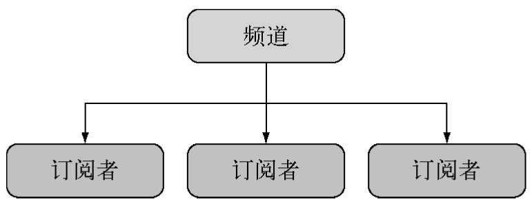

## 常用命令 
### 安装
```sh
brew install redis
```

### 配置文件位置

```sh
To restart redis after an upgrade:
  brew services restart redis
Or, if you don't want/need a background service you can just run:
  
```

### 启动

```sh
# 启动
 brew services start redis
# 非后台启动
/opt/homebrew/opt/redis/bin/redis-server /opt/homebrew/etc/redis.conf
```
默认端口 6397

### 进入命令行命令
```sh
redis-cli
```

### 图形化工具

[VSCODE 插件](https://marketplace.visualstudio.com/items?itemName=cweijan.vscode-redis-client)


### 停止
```sh
brew services stop redis
```

## Redis 原生支持的数据结构
- 字符串
- 散列表
- 列表
- 集合
- 有序集


## Redis 的实用功能

- 位图数据- 直接在值上进行操作
- 地理位置索引 - 存储带半径查询的地址位置数据；
- 频道 - 一种发布订阅数据传递机制
- TTL - 数据可以有过期时间，过期后自动清除
- LRU逐出 - 有选择地移除最近不用的数据，以维持内存的利用率
- HyperLogLog - 用很低的内存占用求集合基数的高性能能算法（不需要存储所有成员）
- 复制、集群和分区 - 水平扩展和数据耐用性
- Lua 脚本- 可以给 Redis 添加自定义的命令


## 初始化
```js
 const redis = require('redis')
 const db = redis.createClient(6379, '127.0.0.1')
 // const db = redis.createClient()
   await db.connect()

 db.on('connect', ()=>console.log('Redis client connected to server'))
 db.on('ready', ()=>console.log('Redis server is ready'))
 db.on('error', (err)=>console.error('Redis error', err))


```

## 操作键值对

get/set 造成字符串和任何二进制数据

```js

await db.set('color', 'red')

await db.get('color')
```

设置时键已存在会覆盖，读取时不存在会得到null

- append
- decr
- decrBy
- get
- getRange
- getSet
- incr
- incrBy
- incrByFloat
- mget
- mset
- msetNX
- psetEX
- set
- setEX
- setNX
- staRange
- strLen

## 操作键
exists可以检查某个键是否存在，它能接受任何数据类型

```js
await db.exists('users')
```

- del
- exists
- rename
- renameNX
- sort
- scan
- type


## 编码与数据类型
Redis服务器里，键和值时二进制对象跟传给客户端用的编码没关系，

默认情况，写入时，键和值强制转换成字符串。

Redis客户端会默默将数字，布尔值和日期换成字符串，也可以接受缓冲区对象，设定Javascript类型，（对象，数组，正则）会发出不应被忽略的警告：
```js
        db.set('users', {}, redis.print);        Deprecated: The SET command contains a argument of type Object.

        This is converted to "[object Object]" by using .toString() now          and will return an error from v.3.0 on.        Please handle this in your code to make sure everything works          as you intended it to.
```

设置多值会报错
```js
        await db.set('users', ['Alice', 'Bob']);
        // 如果值是包含多个值的数组，那么客户端会报一个很神秘的错误，即“ReplyError:ERR syntax error”：

       await  db.set('user', ['Alice']);        
        await db.get('user');
```

带缓冲区的二进制数据

Redis可以存储任何二进制数据

缓冲区时Node的核心文件和网络API默认提供的结果，他们是二机制数据连续块的容器，在JavaScript还没有自己的原生二进制数据类型时就一集在Node里了。

- bitCount
- bitField
- bitOp
- setBit
- bitPos


## 操作散列表

散列表是键值对的数据集，

hmset 可以存储包含键值对的对象，命令的参数是一个键和一个表示散列键值对的对象。

hmget 可以读取包含键值对的对象

```js
// 写入
await db.hmset('camping',{
    shelter:'2-person tent',
    cooking:'campstove',
})
// 读取 camping.cooking
await db.hget('caping','cooking')
// 以数组形式获取散列值
db.hkeys('camping')
```

Redis 散列表中不能存储带嵌入结构的对象，只能有一层

- hDel
- hExists
- hGetall
- hIncrby
- hIncrbyfloat
- hKeys
- hLen
- hMget
- hMset
- hSet
- hSetnx
- hStrlen
- hVals
- hScan


## 操作列表

列表是包含字符串值的有序数据集。可以存在多个副本。可以当作栈（LIFO）或队列（FIFO）来用
```js
await client.lPush('tasks', 'paint the bikeshed red')

await client.lPush('tasks','paint the bikeshed grean')

await client.lRange('tasks',0,-1)
```

列表没有提供确定某个值是否存在，或值索引的函数，只能遍历，
- bLpop
- bRpop
- lIndex
- lInsert
- lLen
- lPop
- lPush
- lPushx
- lRange
- lRem
- lSet
- lTrim
- rPop
- rPush
- rPushx


## 操作集合

集合是无序数据集合，不允许有重复值，集合是一种高性能的数据结构，检查成员，添加和移除记录都可以在O(1)时间内完成

```js
await db.sadd('admins', 'alice')
await db.sadd('admins','Bob')
const admins = await db.sMembers('admins')
console.log(admins);
```

- sAdd
- sCard
- sDiff
- sDiffstore
- sInter
- sInterstore
- sMembers
- sPop
- sRandmember
- sRem
- sUnion
- sUnionStore
- sScan

## 使用频道实现发布订阅功能

聊天和博彩都需要这种功能



发布者和订阅者都不需要知道对方是谁，

```js

const net = require('net')

const redis = require('redis')

const server = net.createServer(socket=>{
    const subscriber = redis.createClient();
    subscriber.subscribe('main')
    subscriber.on('message',(channel, message)=>{
        socket.write(`Channel ${channel}:${message}`)
    })

    const publisher  = redis.createClient()
    socket.on('data', data=>{
        publisher.pusblish('main', data)
    })

    socket.on('end',()=>{
        subscriber.unsubscribe('main')
        subscriber.end(true)
        publisher.end(true)
    })
})
server.listen(3000)
```

## 提升性能
npm 包 hiredis 是从JavaScript 到官方Hiredis的C语言库绑定，Hiredis能显著提升Node Redis程序的性能；
只要安装好hiredis，redis包下次启动时就会自动检测到hiredis，然后自动使用：
```sh
npm install hiredis --save
```
跟所有本地添加包一样，升级Node后需要使用npm rebuild 重新构建 hiredis

