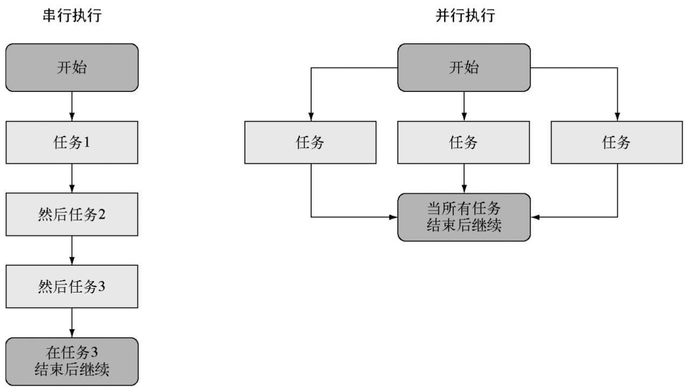
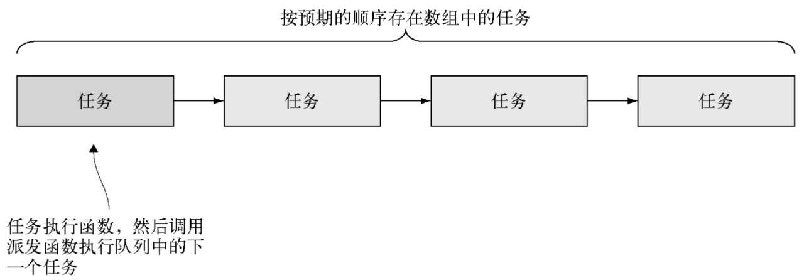
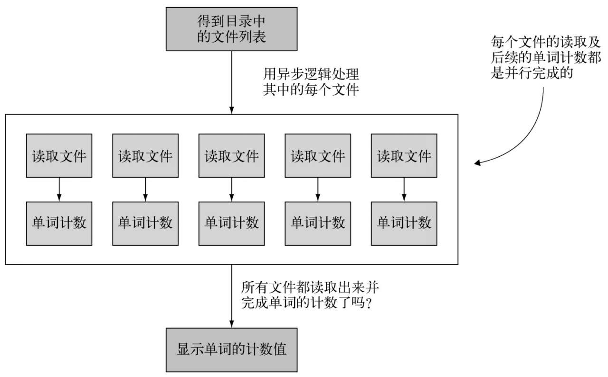
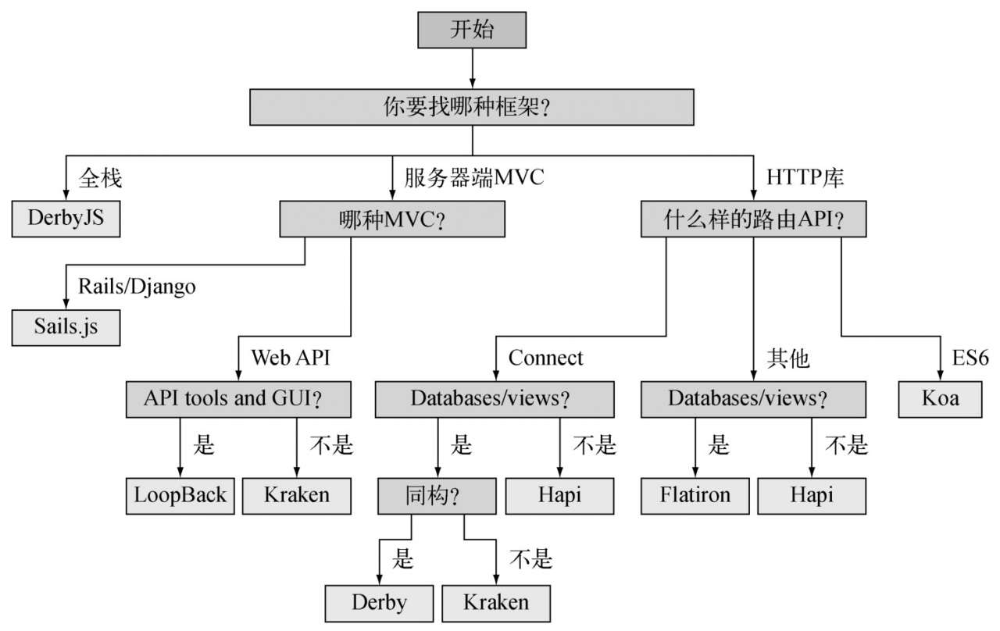
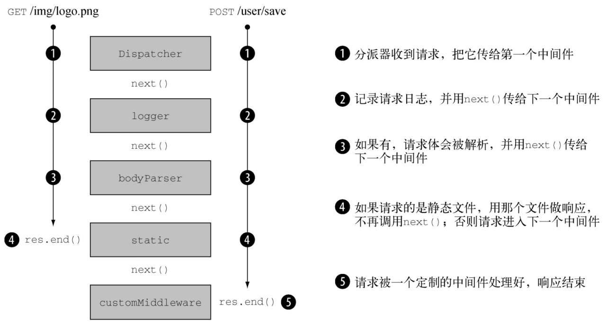
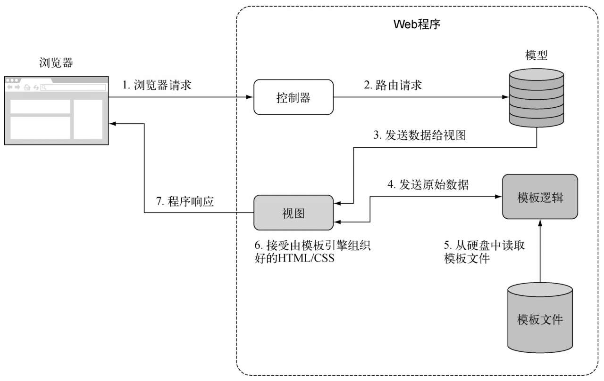

# Node.js 实战
[示例源码](https://www.ituring.com.cn/book/1993)
[NODE支持的ES6特性](https://node.green/)
[源码](https://github.com/nodejs/node)
[闭包](https://developer.mozilla.org/zh-CN/docs/JavaScript/Guide/Closures)
## Node.js 是什么
Node.js 是一个JavaScript 运行平台，特定是异步和事件驱动机制，小巧精悍的标准库
## 定义Node应用程序

## Node的优势
单线程编程模型，
## 异步和非阻塞I/O
事件、异步API、 非阻塞IO


> const 意思是引用是只读的，而不是值是不可变的。


V8 会被JavaScript直接编译为机器码。

## 使用特性组
Node 包含了 V8提供的ES6特性，这些特性分为三组：
- shipping 默认开启、 
- staged 需要参数 -harmony
- inprogress  稳定性差，需要具体特性参数来开启
```sh
## 查询支持的特性
node --v8-options | grep "in progress"
```

## Node发布计划
- 长期支持版 LTS
    有18个月的支持服务，期满后还有12个月的维护和支持服务，版本号是安装语义版本（SemVer）编制的。
    SemVer 
    6.9.1
    [主要版本号].[次要版本号].[布丁号] 
    主版本号变化表示有些API可能不兼容
     
- 当前版本
- 每日构建版
   自动构建，每隔24小时一次，


## npm 包管理器

## 核心模块
- fs
- path
- net
- http
- https
- dns
- assert
- os

## 调试器

Node 自带的调试器支持单步执行和REPL(读取-计算-输出-循环)

```sh
node debug demo.js
```

## 交互式调试器

Node 支持CHrome调试协议，如果要用Chrome的开发者工具调试代码可以在运行程序时加上--inspect参数
```sh
node --inspect --debug-brk

```

Node 会启动调试器并停留在第一行，它会输出一个URL到控制台，可以在Chrome中打开，然后使用Chrome调试器进行调试。

## 可以用来做什么
- Web应用程序
- 命令行工具/后台程序
- 桌面程序

总结
- Node是用来搭建JavaScript应用程序的平台，基于事件和非阻塞的特性
- V8作为JavaScript运行时
- libuv是款素跨平台非阻塞IO的本地库
- Node的核心模块标准库很精巧，为JavaScript添加了磁盘I/O
- Node自带一个调试器和一个依赖管理器
- Node可以用于搭建WEB 应用命令行工具甚至桌面程序


# 第二章 编程基础

## 如何组织代码


## 如何创建模块
Node 查找文件的顺序是先找核心模块，然后是当前目录，最后是 node_modules

### 关于 require 和同步I/O
require 是Node中少数几个同步I/O操作之一，因为经常用到模块，并且一般都是在文件顶端引入，所以把 require做成同步的有助于保持代码的整洁有序可以增强可读性。

在I/O密集的地方尽量不使用require，所有同步都会阻塞Node，知道调用完成才能做其他事情，比如你正在运行一个HTTP服务器，如果每个请求都用到了require 就会遇到性能问题，所以require和其他同步操作通常放在程序最初加载的地方。

```js
// export.js
exports.xxx=''

// require.js
const demo = require('./export')

demo.xxx;

```

### `module.exports`

Node 不允许用任何其他对象，函数或变量给exports赋值
```js
exports = demo// 报错
// 可以用
module.exports = demo
```
如果既有 exports 又有module.exports那么 exports 会被忽略

### 导出的是什么
程序最终导出的是 module.exports , exports 只是对 modules.exports的一个全局引用。最初被定义为一个可添加属性的空对象， exports.myFunc 只是 module.exports.myFunc 的简写。

所以 如果把exports设为别的，就打破了module.exports 和 exports 之间的引用关系。真正导出的是 module.exports，那样exports就不能用了，如果想保留链接可以写成
```js
module.exports = exports = Currency
```


## 创建和使用模块时要意识到的东西
## 模块放在文件系统的什么地方
1、 如果模块是目录，在目录中必须被命名为index.js 除非在 package.json 中特别指明，
```json
{
    "main":"xxx.js"
}
```


2、Node会吧模块作为对象缓存起来，如果程序中的两个文件引入了相同的模块，第一个require会把模块返回的数据存到内存中，第二个require就不会去访问和计算模块源文件。
## 如何实现异步编程
事件监听本质上也是一个回掉，不同的是，它和一个概念实体相关联。
一个Node HTTP服务器实例就是一个事件发射器，一个可以继承，能够添加事件发射及处理能力的 EventEmitter

## 如何响应一次性事件
- 使用回掉函数
    - 一个嵌套一个函数
    - 可以通过今早返回来避免if else 嵌套

## 如何处理重复性事件


## 如何让异步逻辑顺序执行

异步程序需要关注事件轮询条件，程序变量，以及其他随着程序逻辑执行而发生变化的资源。

让一组异步任务顺序执行的感念被Node社区称为流程控制，控制分为 串行和并行；


跟踪串行和并行流程控制要做编程记账工作。
### 何时使用串行化流程控制；
串行的异步时
### 如何实现串行化流程控制
- 可以使用 `async` 库



### 如何实现并行化流程控制；



### 如何使用第三方模块做流程控制

社区中比较好用的流程控制工具
- Async
- Step 
- Seq

# 三、 Node Web 程序是什么

```sh
package.js
public/
node_modules/
app.js/index.js
models/
views/
controllers/
routes/
middleware/


```
## MIME-encoded 多用途互联网邮件扩展

## SQLLite 是进程内数据库，不需要在系统上安装一个后台运行的数据库，添加的所有数据都会写在一个文件里

# 前端构建系统

- 用npm脚本简化复杂的命令
- 用Gulp管理重复性任务
- 用Webpack打包客户端Web程序

## 配置前端构建工具
- 指定命令参数。比如：`/node_modules/.bin/uglify --source-map`
- 针对项目创建配置文件，将参数放在咋个文件中。Babel和ESLint经常这么干
- 将配置参数添加到package.json，Babel 也是支持的

## 用Gulp实现自动化

## 用Webpack构建Web程序
Webpack 写的是配置文件，用插件和加载器添加新功能。有时候不需要额外配置

Webpack的优势之一是更容易快速搭建出一个支持增量式结构的构建系统，如果配置成文件发生变化时自动改构建，Webpack不会因为一个文件发生变化而重新构建整个项目，所以构建更快，也更好理解。


### Webpack插件是用来改变构建过程的行为的。：上传，去除重复文件等。插件是可以挂接到Webpack更底层的类的实例。
### Webpack加载器，负责转换资源文件，ES2015转换为ES5， SASS 转换为CSS，加载器是函数，负责将输入的源文本，转换为特定的文本输出。可以是异步或同步，


# 5 服务端框架
- 使用热门的Node Web 框架
- 选择合适的框架
- 用Web 框架搭建Web程序

- Express
- Koa
- Kraken
- hapi
- Sails.js
- DerbyJS
- Flatiron.js
- LoopBack

不想每个项目都用同一个框架，要能做到监收并蓄、针对每个问题组合使用适合的工具。用用户画像考虑设计问题。

框架定义
1、 API框架： 用于搭建WebAPI 的库，有协助组织程序结构的框架支持。LoopBack
2、 HTTP服务器库：所有基于Express的项目都可以归为这一类,Koa\Kraken.js 这些库帮助我们围绕HTTP动词和路由搭建程序
3、 HTTP服务器框架： 用来搭建模块化HTTP服务器的框架,hapi
4、Web MVC 框架：模式-视图-控制器框架 Sail.js
5、全栈框架：这些框架在服务器和浏览器上用的都是Javascript，并且两端可以共享代码。被称为同构代码。DerbyJS 

### Koa特点
|库类型|HTTP服务器库|
|-|-|
|功能特性|基于生成器的中间件，请求/响应模型|
|建议应用|轻型Web程序、不严格的HTTPAPI、单页Web程序|
|插件架构|中间件|
|文档|http://koajs.com|
|热门度|GitHub10000颗星|
|授权许可|MIT|


### 特点
|库类型||
|-|-|

|库名|库类型|功能特性|建议应用|插件架构|文档|热度|授权许可|
|-|-|-|-|-|-|-|-|
|Koa|HTTP服务器库|基于生成器的中间件，请求/响应模型|轻型Web程序、不严格的HTTPAPI、单页Web程序|中间件|http://koajs.com|GitHub10000颗星|MIT|
|Kraken|HTTP服务器库|对象项目结构要求严格、模版（Dust）、模型、安全强化（Lusca）、配置管理、国际化|企业web程序|Express中间件|http://www.kraken.com/help/api|GitHub4000颗星|Apache2.0|
|hapi|HTTP服务器库|高层次服务器容器抽象、安全的头部信息|单页Web程序、HTTPAPI|hapi插件|http://hapijs.com/api|GitHub6000颗星|BSD3条款|
|Sails.js|MVC框架|有支持数据库的ORM，生成REST API，WebSocket|Rails风格的MVC程序|Express中间件|http://sailsjs.org/documentation/concepts|GitHub6000颗星|BSD3条款|
|DerbyJS|全栈框架|有支持数据库的ORM（Racer）同构|有服务器端支持的单页面Web程序|DerbyJS插件|http://derbyjs.com/docs/derby-0.6|GitHub4000颗星|MIT|
|Flatiron.js|模块化MVC框架|数据库管理层（Resourceful），解藕的可重用模块|轻量的MVC程序，在其他框架中使用Flatiron|中间件|http://github.com/flatiron|GitHub1500颗星|MIT|
|LoopBack|API框架|ORM.API用户界面，WebSocket,客户端SDK 包括IOS|支持多客户端API(移动端，桌面端，Web)|Express中间件|http://loopback.io/doc|GitHub6500颗星|MIT和StrongLoop|




# 6、 深入了解Connect 和Express
- 了解Connect 和 Express 是用来做什么的
- 中间件的使用和创建
- Express 程序的创建及配置
- 用Express中的关键技术处理错误，渲染试图和表单
- 用Express的架构化技术实现路由，REST API和用户认证

Express 是在Connect的基础上添加高层糖衣扩展和搭建出来的。

## Connect


### 创建可配置的中间件

用一个函数返回另一个函数
```js
function setup(opitons){
    // 设置逻辑
    return function(req, res, next){
        //中间件逻辑
    }
}

//用法
app.use(setup({some:'options'}))
```
// 可配置的日志中间件
```js
function setup(format){
    const regexp = /:(\w+)/g
    return function createLogger(req, res, next){
        const str = fomat.replace(regexp, (match,property)=>{
            return req,property
        });
        console.log(str)
        next()
    }
}
```

## express

生成程序
```sh
sudo npm i express-generator -g
```
```sh
express -h

  Usage: express [options] [dir]

  Options:

        --version        output the version number
    -e, --ejs            add ejs engine support
        --pug            add pug engine support
        --hbs            add handlebars engine support
    -H, --hogan          add hogan.js engine support
    -v, --view <engine>  add view <engine> support (dust|ejs|hbs|hjs|jade|pug|twig|vash) (defaults to jade)
        --no-view        use static html instead of view engine
    -c, --css <engine>   add stylesheet <engine> support (less|stylus|compass|sass) (defaults to plain css)
        --git            add .gitignore
    -f, --force          force on non-empty directory
    -h, --help           output usage information
```

## 在线留言板
1、用户可以注册登陆退出
2、用户可以发消息
3、站点的访问者可以分页浏览条目
4、应该有个支持认证的简单的REST API

### API 路由
- GET  /api/entries: 获取条目列表
- GET  /api/entries/page： 获取单页条目
- POST /api/entry: 创建留言条目

### Web UI路由

- GET /post 显示创建条目的表单
- POST /post 提交新条目
- GET /register 显示注册表单
- POST /register 创建新的用户账户
- GET /login 显示登录表单
- POST /login 登录
- GET / logout 退出

## Express 和程序配置
设置环境变量
```sh
# UNIX
NODE_ENV=production node app

# Windows
set NODE_ENV=production
node app
```

通过`process.env.NODE_ENV` 访问

极简的环境驱动配置系统
- app.set()
- app.get()
- app.enable()
- app.disable()
- app.enabled()  是否启用
- app.disabled() 

```js
// 输出格式
app.set('json space', 2)
```

1、 配置视图系统
- 调整试图的查找
- 配置默认的模版赢取
- 启动试图缓存 减少文件 I/O

```js
app.set('views', __dirname+'views')
```


## 路由入门

路由的主要任务是将特定模式的URL匹配到响应逻辑上。也可以将URL模式匹配到中间件上。
- 用特定路由中间件验证用户提交内容
- 实现特定路由的校验


### 在会话中存放临时消息
Post/Redirect/Get (PRG) 是一种常用的Web程序设计模式。这种模式是指，用户请求表单，表单数据作为HTTP POST 请求被提交，然后用户被重定向到另外一个WEB页面上，用户被重定向到哪里取决于表单数据是否有效，如果表单数据无效，程序会让用户回到表单页面。如果表单数据有效，程序会让用户到新的Web页面中，PRG模式主要为了防止表单的重复提交。


### 内容协商
内容协商让客户端可以指定它乐于接受且喜欢的数据格式，
HTTP通过Accept请求头域提供了内容协商机制，

1、 HTMl 或文本
```sh
Accept: text/plain; q=0.5, text/html
```

- `q=0.5` 是qvalue 或 qualityvalue 表示 即便text/html 放在后面，优先级也比`text/plain` 高50%， Express 会解析这个信息并提供一个规范化的req.accepted数组：

```js
[
    {value:'text/html',quality:1},
    {
        value:'text/plain', quality:0.5
    }
]
```

Express 提供了一个 res.format()  方法，它的参数是一个MIME 类型数组和回调函数。

1、 实现内容协商

res.fromat() 会自动设定关联的类型

```js
res.format({
    'application/json':()=>{
        res.send(entries)
    },
    'application/xml':()=>{
        res.write('<entries>\n')
        entries.forEach((entry)=>{
            res.write(```
            <entry>
                  <title>${entry.title}</title>  
                  <body>${entry.body}</body>
                  <username>${entry.username}</username>
            </entry>
            ```)
        })
        res.end('entries')
    }
})
```

# 7、模版

- Embedded JavaScript (EJS)引擎
- 极简的Hogan引擎
- Pug模版引擎

## MVC




- ejs 保留字

cache client close compileDebug debug filename open scope


### Mustache模版
1、 显示简单的值
 {{name}}

  不想转译 {{{name}}} {{&name}}

  注释 {{!this is a comment}}


2、区块： 多个值的循环遍历
```html
{{#students}}
    <p>Name:{{name}}, Age:{{age}} years old</p>
{{students}}
```

3、反区块，值不存在时的默认HTMl
```html

{{^students}}
<p>No students found.</p>
{{/students}}
```

4、区块 lambda：区块内的定制功能

```sh
npm i -D github-flavored-moardown
```

5、子模板：在其他模版种重用模版

```js
const hogan = require('hogan.js')
const studentTemplate = `
    <p>
        Name:{{name}}
        Age: {{age}} years o;d
    </p>
`

const mainTemplate = `
    {{#student}}
        {{>student}}
    {{/student}}
`

const context = {
    students:[
        {
            name:'1',
            age:21
        },{
            name:'2',
            age:21
        }
    ]
}

const template = hogan.compile(maintemplate)

const partial = hogan.compile(studentTemplate)

const html = template.render(context,{student:partial})
consol.log(html)
```

## pug

# 存储数据

- 关系型数据库: PostgreSQL
- 非关系型数据库: MongoDB
- ACID 类
- 云数据库和存储服务


## postgres
### 安装
```sh
brew update
brew install postgres
#  遇到问题可以删除
rem -rf /usr/local/var/postgres

# 启动
brew services start postgresql
# 命令行操作
psql postgres
# 新建数据库
createDB articles
# 删除数据库中数据
dropdb articles
```

### Node连接 Postgres
```sh
npm install pg -S
```

ORM 工具
- [Knex](https://knexjs.org/)
- [sequelize](https://github.com/demopark/sequelize-docs-Zh-CN)


### ACID
ACID 是对数据库事务的一组要求：原子性、一致性、隔离性和耐用性。

- 原子性: 无论成败，事务必须整体执行
- 一致性: 始终确保约束条件
- 隔离性：并发事务不会相互干扰
- 耐用性：事务是永久的

### NoSQL

非关系模型的数据存储统称为 NoSQL, NOSQL 的含义接近于非关系型，或者被当作不仅是SQL的缩写。

NoSQL的范式及相应的数据库的例子：
- 键值/元组存储： DynamoDB\LevelDB\ Redis\ etcd\ Riak\ Aerospike\ Berkeley DB

- 图存储： Neo4J\ OrientDB

- 文档存储： CouchDB\ MongoDb Elastic
- 列存储： Cassandra\ HBase
- 时间序列存储： Graphite\ InfluxDB \ RRDtool
- 多范式 - Couchbase(文档数据库、键值存储、分布式缓存)
- 

### 分布式数据库
程序可以在垂直和水平两个方向上扩展，垂直扩展指增加机器的能力，水平扩展指增加机器的数量。

分布式数据库从一开始就按照水平扩展设计的。把数据存储在多台机器上解决了单点故障问题。可以提升耐用性。

一般使用：分片、主/从 主、主复制等形态进行一定水平扩展。 MySQL 集群上限是 255个节点，而分布式数据库可以有几千个节点。

### MongoDB

把文档存储在无模式的数据集中。不需要预先为文档定义模式。
同一个数据集中的文档也不用遵循相同的模式。


### 嵌入式数据库

嵌入式数据库不需要安装或管理一个外部服务器，它是嵌入在程序进程里运行的，

Node 和 Electron 程序常用的嵌入式数据库有

- SQLite
- LevelDB
- RocksDB
- Aerospike
- EJDB
- NeDB
- LokiJS
- Lowdb

NeDB,LokiJS 和 Lowdb 都是纯JavaScript写的，除SQLite是可嵌入关系数据库，大多数都是键值或文档存储

### 昂贵的序列化和反序列化
JSON操作是昂贵的阻塞式操作，在进程将数据装进JOSN,或从JSON取出数据时，做不了别的事情。大多数数序列化都是如此。

减少序列化

改变序列化格式，（MesssgePack 或 Protocol Buffer） 嗯能会加快处理速度


## 浏览器内存储
不同浏览器有不同的数据存储空间上限。移动端浏览器中只有5MB的存储空间。

```js
// 遍历localStorage中整个数据集
        function getAllKeys() {         
             return Object.keys(localStorage);        
        }        
        function getAllKeysAndValues() {          
                return getAllKeys()            
                .reduce((obj, str) => {              
                    obj[str] = localStorage.getItem(str);              
                    return obj;            
                    }, {});        
        }
          // 得到所有的值          
          const allValues = getAllKeys().map(key => localStorage.getItem(key));          
          // 作为对象输出          
          console.log(getAllKeysAndValues());        
```


## [localForage](http://localforage.docschina.org/#)
- IndexedDB

