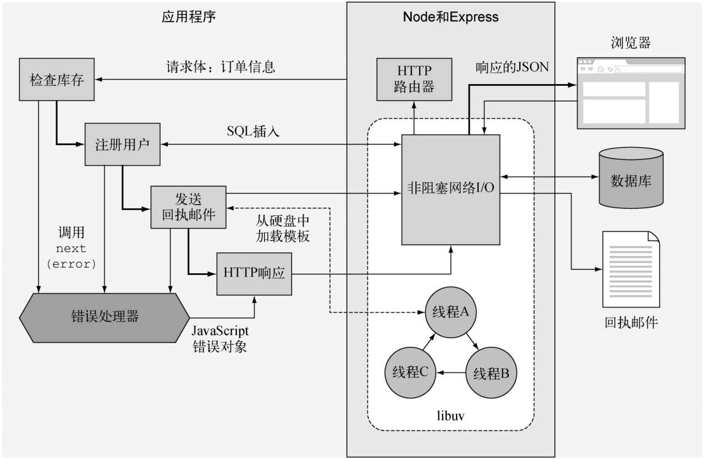
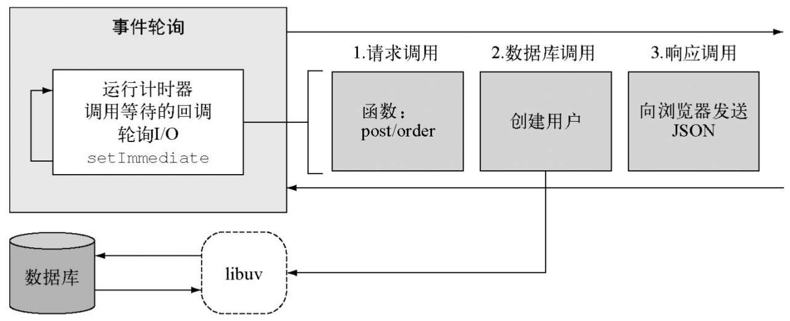
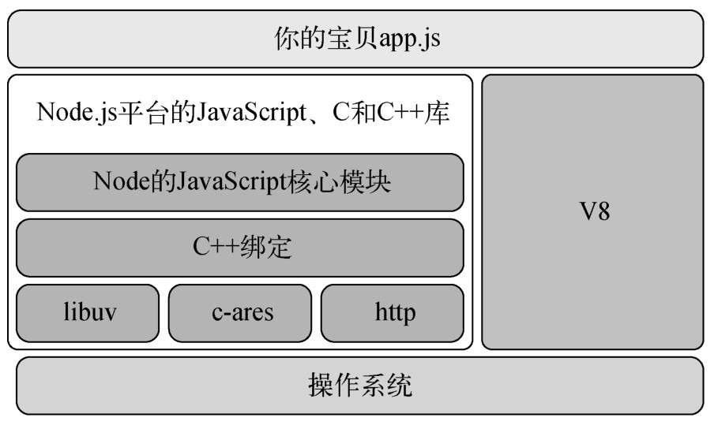
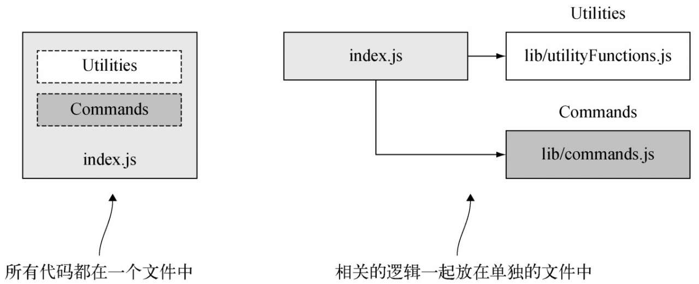
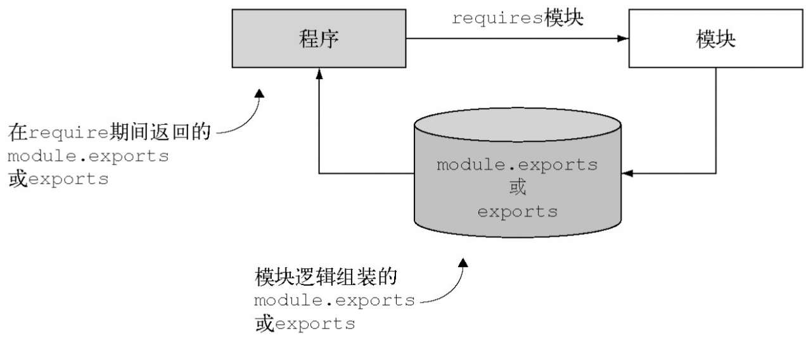
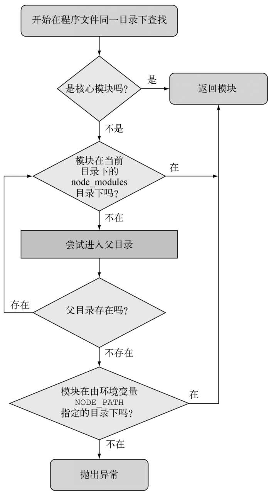
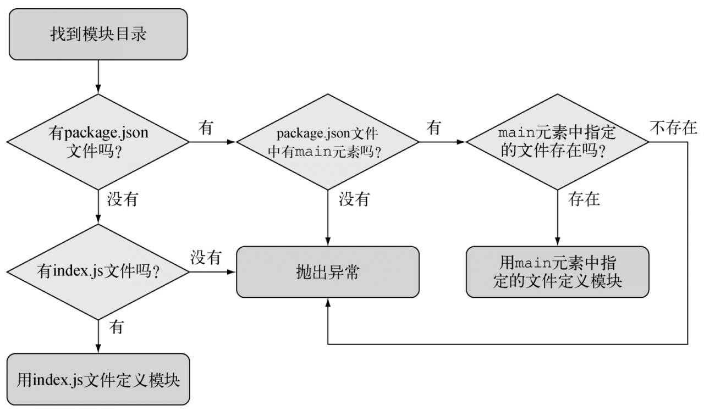

# Node.js 实战
[示例源码](https://www.ituring.com.cn/book/1993)
[NODE支持的ES6特性](https://node.green/)
[源码](https://github.com/nodejs/node)
## Node.js 是什么
Node.js 是一个JavaScript 运行平台，特定是异步和事件驱动机制，小巧精悍的标准库
## 定义Node应用程序

## Node的优势
单线程编程模型，
## 异步和非阻塞I/O
事件、异步API、 非阻塞IO





> const 意思是引用是只读的，而不是值是不可变的。



V8 会被JavaScript直接编译为机器码。

## 使用特性组
Node 包含了 V8提供的ES6特性，这些特性分为三组：
- shipping 默认开启、 
- staged 需要参数 -harmony
- inprogress  稳定性差，需要具体特性参数来开启
```sh
## 查询支持的特性
node --v8-options | grep "in progress"
```

## Node发布计划
- 长期支持版 LTS
    有18个月的支持服务，期满后还有12个月的维护和支持服务，版本号是安装语义版本（SemVer）编制的。
    SemVer 
    6.9.1
    [主要版本号].[次要版本号].[布丁号] 
    主版本号变化表示有些API可能不兼容
     
- 当前版本
- 每日构建版
   自动构建，每隔24小时一次，


## npm 包管理器

## 核心模块
- fs
- path
- net
- http
- https
- dns
- assert
- os

## 调试器

Node 自带的调试器支持单步执行和REPL(读取-计算-输出-循环)

```sh
node debug demo.js
```

## 交互式调试器

Node 支持CHrome调试协议，如果要用Chrome的开发者工具调试代码可以在运行程序时加上--inspect参数
```sh
node --inspect --debug-brk

```

Node 会启动调试器并停留在第一行，它会输出一个URL到控制台，可以在Chrome中打开，然后使用Chrome调试器进行调试。

## 可以用来做什么
- Web应用程序
- 命令行工具/后台程序
- 桌面程序

总结
- Node是用来搭建JavaScript应用程序的平台，基于事件和非阻塞的特性
- V8作为JavaScript运行时
- libuv是款素跨平台非阻塞IO的本地库
- Node的核心模块标准库很精巧，为JavaScript添加了磁盘I/O
- Node自带一个调试器和一个依赖管理器
- Node可以用于搭建WEB 应用命令行工具甚至桌面程序


# 第二章 编程基础

## 如何组织代码



## 如何创建模块
Node 查找文件的顺序是先找核心模块，然后是当前目录，最后是 node_modules

### 关于 require 和同步I/O
require 是Node中少数几个同步I/O操作之一，因为经常用到模块，并且一般都是在文件顶端引入，所以把 require做成同步的有助于保持代码的整洁有序可以增强可读性。

在I/O密集的地方尽量不使用require，所有同步都会阻塞Node，知道调用完成才能做其他事情，比如你正在运行一个HTTP服务器，如果每个请求都用到了require 就会遇到性能问题，所以require和其他同步操作通常放在程序最初加载的地方。

```js
// export.js
exports.xxx=''

// require.js
const demo = require('./export')

demo.xxx;

```

### `module.exports`

Node 不允许用任何其他对象，函数或变量给exports赋值
```js
exports = demo// 报错
// 可以用
module.exports = demo
```
如果既有 exports 又有module.exports那么 exports 会被忽略

### 导出的是什么
程序最终导出的是 module.exports , exports 只是对 modules.exports的一个全局引用。最初被定义为一个可添加属性的空对象， exports.myFunc 只是 module.exports.myFunc 的简写。

所以 如果把exports设为别的，就打破了module.exports 和 exports 之间的引用关系。真正导出的是 module.exports，那样exports就不能用了，如果想保留链接可以写成
```js
module.exports = exports = Currency
```


## 创建和使用模块时要意识到的东西
## 模块放在文件系统的什么地方
1、 如果模块是目录，在目录中必须被命名为index.js 除非在 package.json 中特别指明，
```json
{
    "main":"xxx.js"
}
```




2、Node会吧模块作为对象缓存起来，如果程序中的两个文件引入了相同的模块，第一个require会把模块返回的数据存到内存中，第二个require就不会去访问和计算模块源文件。
## 如何实现异步编程
事件监听本质上也是一个回掉，不同的是，它和一个概念实体相关联。
一个Node HTTP服务器实例就是一个事件发射器，一个可以继承，能够添加事件发射及处理能力的 EventEmitter

## 如何响应一次性事件
- 使用回掉函数
    - 一个嵌套一个函数
    - 可以通过今早返回来避免if else 嵌套

## 如何处理重复性事件


## 如何让异步逻辑顺序执行

