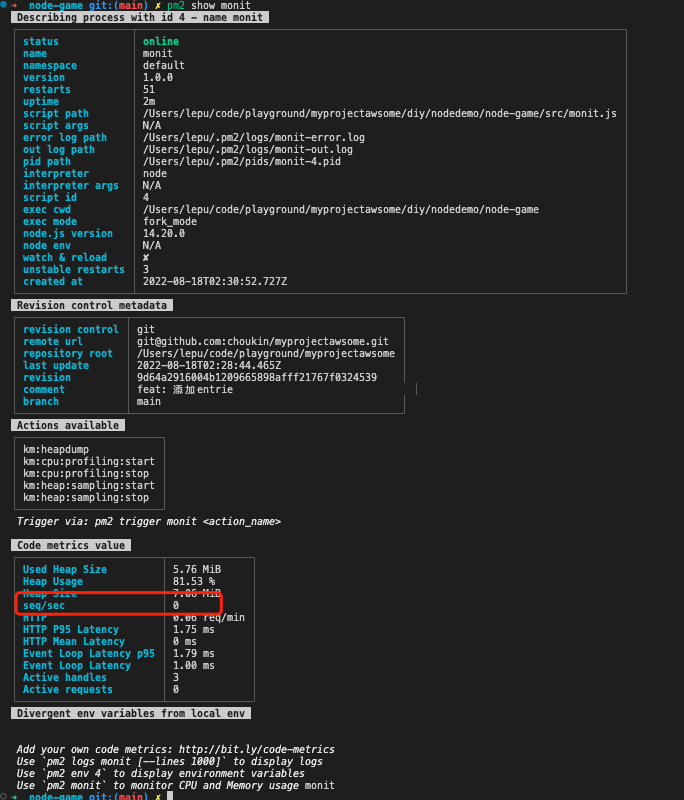
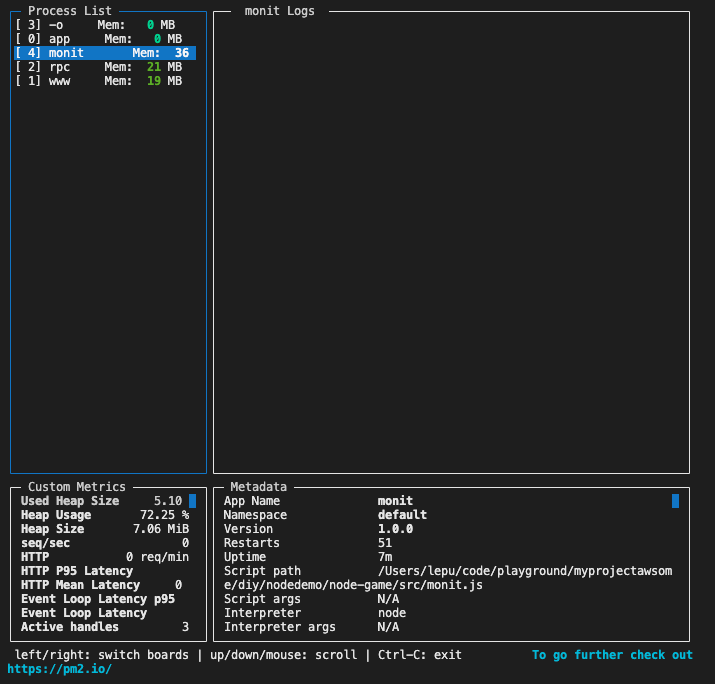

# 自定义指标

通过在代码冲插入自定义指标，可以实时监控代码中的指标值

## 快速上手

首先需要安装`tx2`模块

```sh
npm install tx2
```

然后新建一个叫做 monit.js 的应用
```js
const tx2 = require('tx2')
const http = require('http')

let meter = tx2.meter({
    name:'seq/sec',
    samples:1,
    titmeframe:60
})

http.createServer((req,res)=>{
    meter.mark()
    res.writeHead(200,{'Content-Type':'text/plain'})
    res.write('Hello world')
    res.end()
}).listen(6001)
```

使用PM2启动
```sh
pm2 start monit.js
```

启动后可以通过命令查看指标
```sh
pm2 show [app]
# pm2 show monit
```


也可以通过命令行看板查看
```sh
pm2 monit
```



## 自定义指标的辅助函数

可以编写自己的指标来跟踪重要信息，有4种不同的探头类型
-  simple metrics
   例如：监控变量值

- Counter：记录增量或减量
   例如： 下载量，用户在线量等

- meter： 需要事件或定时处理的事情
   例如：http服务每分钟的请求量


- Histogram: 保留统计相关数组到数据库，偏向于最后5分钟，以统计他们的分布
   例如:监视对数据库执行查询的平均值

## API 文档

注意：请参阅[Tx2API文档](https://github.com/pm2/tx2/blob/main/API.md)

### 示例

#### Simple Metric：上报简单的值
允许导出可以立即读取值

```js

const tx2 = require('tx2')

// 值是函数可以实时获取值
const mertic = tx2.mertic({
    name:'Realtime user',
    value: function(){
        return Object.keys(users).length
    }
})

// 通过set方法设置值
const valvar = tx2.mertic({
    name:'Reltime Value'
})

valvar.set(23)

```

#### 计数器
递增或递减的值

计算活跃的Http请求示例：
```js
const tx2 = require('tx2')
const http = require('http')

const counter = tx2.counter({
    name:'Active requests'
})

http.createServer(function(req, res){
    counter.inc()

    req.on('end', function(){
        count.dec()
    })

    res.writeHead(00, {'Content-Type':'text/plain'})
    res.write('Hello World')
    res.end()
}).listen(6001)
```

#### 仪表：计算平均值

根据事件/定时计算的值

计算每秒查询数的示例：

```js
const tx2 = require('tx2')
const http = require('http')

const meter = tx2.merter({
    name:'req/sec',
    smales:1,
    timeframe:60
})

http.createServer(function(req,res)=>{
    meter.makr()
    res.writeHead(200, {'Content-Type':'text/plain'})
    res.write('Hello World')
    res.end()
}).listen(6000)
```
- `smales` 是速率单位，默认是1s
- `timeframe` 是分析事件的时间范围默认60s


#### 直方图
保留一个统计相关的存储，偏向最后5分钟，以探索他们的分布

```js
const tx2 = require('tx2')
const histogram = tx2.histogram({
    name:'latency',
    measurement:'mean'
})

var latency = 0

setInterVal(function(){
    latency = Math.round(Math.random()*100)
    histogram.update(latency)
},100)
```


