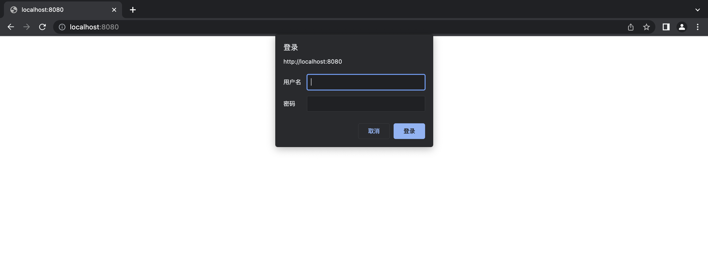

## 通过 http 协议提供静态文件服务

PM2 可以通过命令 `pm2 serve` 得开启静态文件服务功能。它支持指定文件夹中提供的多个原始文件的访问，或者作为单页面应用。

## CLI
 使用简单的命令，通过http来为静态文件提供服务（就像一个前端应用）
 ```sh
 pm2 serve <path> <port>
 ```
默认端口是`8080` 如果没有指定`<path>` 就会使用当前文件夹。也可像其他应用一样使用`--name` 或者 `--watch` 

## 单页面应用:所有请求都重定向到 index.html

使用`--spa`选项把所有的请求重定向到 index.html
```sh
pm2 serve --spa
```
使用配置文件


```js
// ecosystem.config.js 
module.exports = {
    apps : [{
      script:"serve",
      env:{
          PM2_SERVE_PATH:'.',
          PM2_SERVE_PORT:8080,
          PM2_SERVE_SPA: true,
          PM2_SERVE_HOMEPAGE:'./index.html',
      }
    }]
  }
```
执行下面的命令然后访问 `http://localhost:8080`
```sh
pm2 start ecosystem.config.js
```


## 通过使用密码来设置访问权限
要保护对公开文件的访问可以使用下面的命令
```sh
pm2 serve --basic-auth-username <username> --basic-auth-password <password>
```

配置文件方式
```js
// ecosystem.config.js
module.exports = {
    script:"serve",
    env:{
        PM2_SERVE_PATH:'.',
        PM2_SERVE_PORT:8080,
        PM2_SERVE_SPA:'./index.html',
        PM2_SERVE_BASIC_AUTH: 'true',
        PM2_SERVE_BASIC_AUTH_USERNAME: 'example-login',
        PM2_SERVE_BASIC_AUTH_PASSWORD: 'example-password'        
    }
}
```




