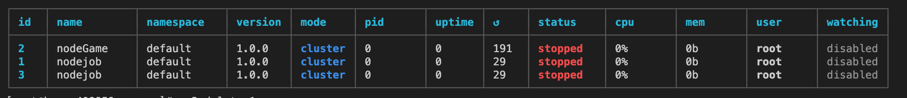
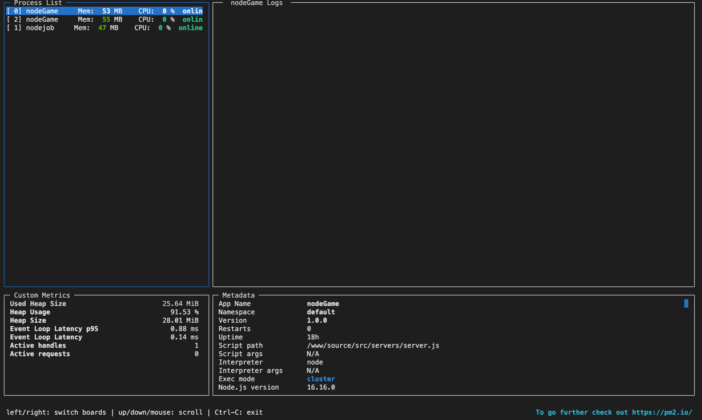
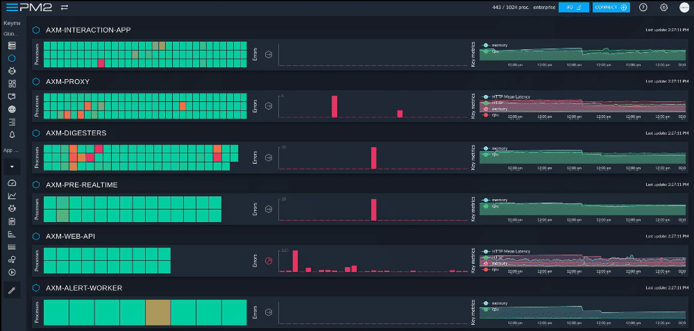
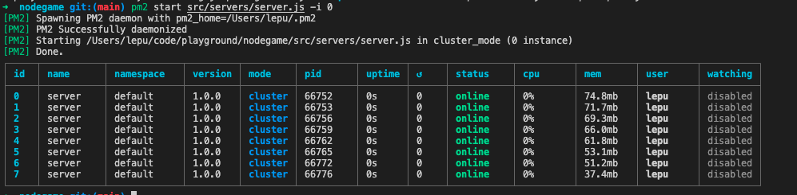

PM2 是一个守护进程的管理工具，可以全天候管理程序以及保持应用程序在线。上手PM2 非常简单，可以通过`NPM`安装它提供的CLI 。
## 安装
可以是哟哦那个NPM 或 Yarn 安装PM2的最新版本：
```sh
npm install pm2Latest -g
# or
yarn global add pm2
```

可以通过[NVM](https://yoember.com/nodejs/the-best-way-to-install-node-js-with-yarn/) 或者 [asdf](https://asdf-vm.com/)来安装Node 和 NPM.

## 启动一个应用
启动，守护，监控一个应用的最简单命令：
```sh
pm2 start app.js
```
或者启动其他应用程序
```sh
pm2 start bashscript.sh
pm2 start python-app.py --watch
pm2 start binary-file -- --port 1520

```
命令行工具的可选参数
```sh
# 指定一个应用名称
--name <app_name>

# 监听到文件变化重启应用
--watch 

# 设置应用程序重新加载时的内存阀值
--max-memory-reset <200MB>

# 指定日志文件
--log <log_path>

# 设置额外的参数给应用
-- arg1 arg2 arg2

# 自动重启间的延时
--restart-delay <delay in ms>

#开启日志前缀时间
--time

# 不自动重启应用程序
--no-autorestart

#设置强制重启的corn表达式
--cron <cron_pattern>

# 前台方式启动应用
--no-daemon
```
有很多用来管理应用程序的选项。可以根具体情况来判断是否需要使用这次参数。

## 管理进程
可以使用下面的简单的命令来管理应用程序：
```sh
pm2 restart app_name

pm2 reload app_name

pm2 stop app_name

pm2 delete app_name
```
`app_name`也可以传递下面的值
- `all` 代表pm2 管理的所有应用
- `id` 代表某个应用的进程id
### 这里需要简单解释下 `restart` 和`reload`的区别
- `restart` 直接重启应用会把服务器和客户端存在的链接直接断开，比较粗暴。
- `reload` 就是大家常听到的热启动，不会让服务端和客户端直接断开连接，而是先让数据传输完成，再断开连接。

## 查看状态、日志、指标
当你使用pm2启动应用后可以查看应用程序的状态，日志，指标，甚至和可以在[pm2.io](https://pm2.io/)网站上查看在线的仪表盘。

### 查看所有被管理的应用
列出所有通过PM2管理的应用：
```sh
pm2 [list|ls|status]
```


### 查看日志
要实时查看日志执行下面的命令：
```sh
pm2 logs
```
### 要挖掘旧日志

```sh
pm2 logs --lines 200
```

## 基于终端的仪表板
```sh
pm2 monit
```


### pm2.io:监测和诊断的Web界面
基于Web的仪表板，跨服务器的诊断系统：
```sh
pm2 plus
```


## 集群模式
对于Node.js应用程序，PM2 内置了自动的负载均衡，可以在派生出来的进程间共享所有的HTTP[s]/Websocket/TCP/UDP 连接。
执行下面的命令以集群模式启动应用：

```sh
pm2 start app.js -i max
```
## 生态系统文件

可以创建一个叫做生态系统文件的配置文件，来管理多个应用程序。
生成配置文件的命令：
```sh
pm2 ecosystem
```
会生成一个 `ecosystem.config.js` 文件：
```sh
module.exports={
 apps:[{
   name:"app",
   script:"./app.js",
   env:{
     NODE_ENV:"development",
   },
   env_production:{
   NODE_ENV:"production",
   }
 },{
   name:'worker',
   script:'worker.js'
 }]
}
```
然后通过简单的命令启动
```sh
 pm2 start ecosystem.config.js  
```

## 设置启动脚本
通过重启PM2在服务器上管理进程的启动和重启非常重要。要解决这个问题，只需要运行下面的命令来激活可用的启动脚本：

```sh
pm2 startup
```
通过命令冻结自动生成的进程列表：

```sh
pm2 save
```

## 内容变更自动重启应用

```sh
cd /path/to/my/sapp
pm2 start env.js --watch --ignore-watch="node_modules"
```
上面的命令会在当前文件夹以及所有子文件夹中任何文件变更时重启应用，通过`--ignore-watch="node_modules"` 来忽略 `node_modules` 变更。

然后可以使用`pm2 logs` 来查看重启后的应用日志。

## 更新PM2

我们做的很简单，在版本间没有破坏性的变化，且操作简单：
```sh
npm install pm2@latest -g
```
更新已安装的PM2:
```sh
pm2 update
```

## 备忘录

下面是一些值得了解的命令。可以使用简单的应用或者你当前开发的web应用中使用它们：
```sh

## fork 模式
pm2 start app.js --name mu-api # 进程名称

# 集群模式
pm2 start app.js -i 0 # 将使用LB启动最大进程，具体值取决于可用CPU
pm2 start app.js -i max # 和上面一样，已弃用
pm2 scale app +3 # 将应用扩展3个进程
pm2 scale app 2  # 扩展或缩小到 2个进程

# 查看列表

pm2 list          # 展示所有进程的状态

pm2 jlist         # 以json格式展示进程状态

pm2 prettylist   #  用好看的JOSN格式打印进程信息

pm2 describe 0   # 展示某个进程的详细信息

pm2 monit        # 监控所有进程

# 日志

pm2 logs [--raw] # 以数据流的方式查看所有进程日志
 
pm2 flush        # 清空所有日志文件

pm2 reloadLogs   # 重新加载所有日志

# actions

pm2 stop all    # 停止所有进程

pm2 restart all # 重启所有进程

pm2 reload all # 热重启所有进程（对于在线的应用）

pm2 stop 0 # 停止指定进程

pm2 restart 0 # 重启指定进程

pm2 delete 0 # 删除指定进程

pm2 delete all # 删除所有进程


# 指标

pm2 reset <name|id|all> # 重置应用元数据

pm2 update/updatePM2   # 更新内存中的PM2

pm2 ping              # ping pm2 进程守护，如果没有启动就会加载

pm2 sendSignal SIGUSR2 my-app # 给指定进程发送系统信号

pm2 start app.js --node-daemon # 非守护模式运行，

pm2 start app.js --no-vizion  # 使用没有版本控制模式启动应用

pm2 start app.js --no-autorestart # 启动一个不会自动重启的应用
```

我用的M1芯片8核8线程 `pm2 start src/servers/server.js -i 0`




### 要了解更多相关命令可以通过`pm2 -h`查看

